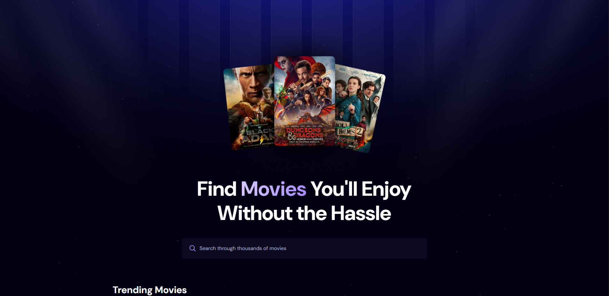

# 🎬 Cinéphile

A modern movie browsing web application built with React.js, Appwrite, and Tailwind CSS. CineVibe allows users to explore trending movies, search through thousands of films, and enjoy a sleek, responsive interface powered by The Movie Database (TMDb) API. Perfect for movie enthusiasts and developers looking to learn full-stack development with modern technologies.


📺 **Live Demo:** [Cinephile](https://cinephile-virid.vercel.app/)

---

## 🖼️ Preview


---

<div align="center">
  <br />
      
    </a>
  <br />
  
  <div>
    
    
    
  </div>

  <h3 align="center">A Movie Application</h3>


</div>

## 📋 <a name="table">Table of Contents</a>

1. 🤖 [Introduction](#introduction)
2. ⚙️ [Tech Stack](#tech-stack)
3. 🔋 [Features](#features)
4. 🤸 [Quick Start](#quick-start)
5. 🌐 [Environment Variables](#environment-variables)
6. 📁 [Project Structure](#project-structure)
7. 🤝 [Contributing](#contributing)
8. 📜 [License](#license)


## <a name="introduction">🤖 Introduction</a>

Cinephile is designed to make movie discovery fun and effortless. With a clean, modern UI, users can browse trending movies, search for specific titles, and view detailed movie information. The app leverages Appwrite for backend storage of trending search data and TMDb API for movie data, making it a great example of a full-stack JavaScript project.

## <a name="tech-stack">⚙️ Tech Stack</a>

- **Frontend**: React.js
- **Backend**: Appwrite (for trending movies storage)
- **Styling**: Tailwind CSS
- **API**: The Movie Database (TMDb) API
- **Build Tool**: Vite
- **Deployment**: Vercel

## <a name="features">🔋 Features</a>

👉 **Browse Movies**: Explore a wide range of movies sorted by popularity.

👉 **Search Movies**:  Quickly find movies by title using a debounced search input.

👉 **🎥Trending Movies**: View the most popular search terms, powered by Appwrite.

👉 **💫Responsive Design**: Seamlessly works on mobile, tablet, and desktop devices.

👉 **Modern UI/UX**: Clean, visually appealing interface with Tailwind CSS.

👉 **Error Handling**: Graceful handling of API errors and loading states.

👉 **Responsiveness**: Fully responsive design that works seamlessly across devices.

- ⚡ Real-time movie data from TMDB

- 📊 Search analytics via Appwrite

## <a name="quick-start">🤸 Quick Start</a>

Follow these steps to set up and run Cinephile locally on your machine.

**Prerequisites**

Ensure you have the following installed:

- [Git](https://git-scm.com/)
- [Node.js](https://nodejs.org/en) (v16 or later)
- [npm](https://www.npmjs.com/) (comes with Node.js)

**Cloning the Repository**

```bash
git clone https://github.com/Udayan-Mal/Cinephile.git
cd cinephile
```

**Installation**

Install the project dependencies:

```bash
npm install
```

**Set Up Environment Variables**

Create a `.env` file in the root directory and add the following: 

```env
VITE_TMDB_API_KEY=your_tmdb_api_key

VITE_APPWRITE_PROJECT_ID=your_appwrite_project_id
VITE_APPWRITE_DATABASE_ID=your_appwrite_database_id
VITE_APPWRITE_COLLECTION_ID=your_appwrite_collection_id
```

- **[TMDb API Key:](https://developer.themoviedb.org/reference/intro/getting-started)** Sign up at TMDb and generate an API token.


- **[Appwrite Credentials:](https://appwrite.io/)** Create a project in Appwrite, set up a database and collection, and copy the IDs.


**Running the Project**

Start the development server:

```bash
npm run dev
```

Open [http://localhost:5173](http://localhost:5173)  in your browser to view the app.

---


## <a name="environment-variables">🌐 Environment Variables</a>

The following environment variables are required in the `.env` file:

| Variable | Description |
| --- | --- |
| `VITE_TMDB_API_KEY` | TMDb API token for fetching movie data |
| `VITE_APPWRITE_PROJECT_ID` | Appwrite project ID |
| `VITE_APPWRITE_DATABASE_ID` | Appwrite database ID for storing search data |
| `VITE_APPWRITE_COLLECTION_ID` | Appwrite collection ID for trending searches |

Ensure these are correctly configured to avoid API or backend errors.

---

## 
## <a name="project-structure">📁 Project Structure</a>

```bash
cinephile/
├── public/                  # Static assets (images, SVGs)
│   ├── hero-bg.png
│   ├── hero.png
│   ├── logo.png
│   ├── no-movie.png
│   ├── search.svg
│   ├── star.svg
│   ├── screenshot.png       # Webpage screenshot
├── src/                     # Source code
│   ├── assets/              # Additional assets
│   ├── components/          # React components
│   │   ├── MovieCard.jsx
│   │   ├── Search.jsx
│   │   ├── Spinner.jsx
│   ├── App.css              # App-specific styles
│   ├── App.jsx              # Main app component
│   ├── appwrite.js          # Appwrite configuration
│   ├── index.css            # Global styles with Tailwind
│   ├── main.jsx             # React entry point
├── .env                     # Environment variables
├── .gitignore               # Files to ignore in Git
├── index.html               # HTML template
├── package.json             # Project metadata and dependencies
├── vite.config.js           # Vite configuration
└── README.md                # This file
```

---


## <a name="contributing">🤝 Contributing</a>

We welcome contributions! To contribute:

1. Fork the repository.
2. Create a new branch (`git checkout -b feature/your-feature`).
3. Make your changes and commit (`git commit -m 'Add your feature'`).
4. Push to the branch (`git push origin feature/your-feature`).
5. Open a pull request.

Please ensure your code follows the project’s style guidelines and includes tests where applicable.

---

## 
## <a name="introduction">📜 License</a>

This project is licensed under the MIT License. See the LICENSE file for details.

---

Enjoy exploring movies with **Cinephile**! 


